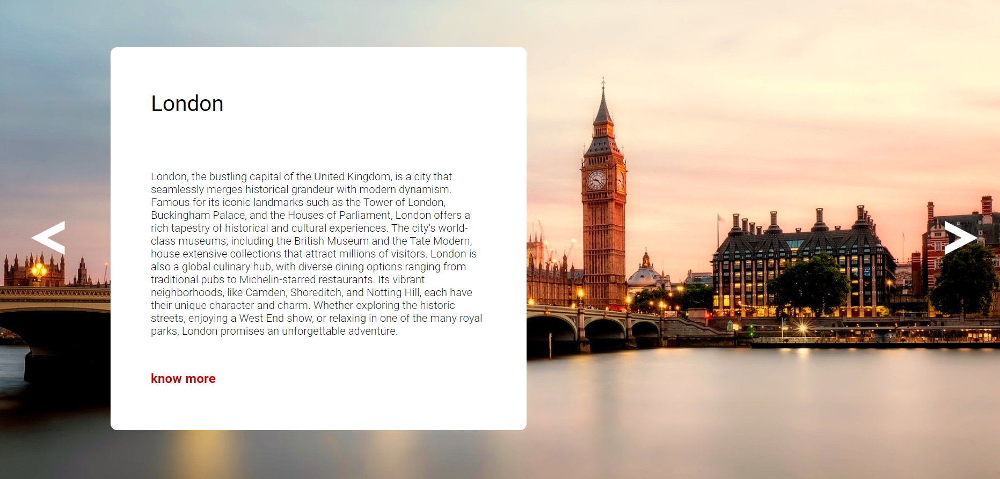

# Site Capitals of europe ✈️🌎
Este projeto consiste em uma página web tem informaçãoes de viagem sobre algumas capitais da europa. O projeto é ideal para iniciantes que querem aprender a  adicionar interatividade a uma página web em JavaScript, além de praticar habilidades básicas de HTML e CSS.

## Funcionalidade
Design responsivo: A página é responsiva, adequando-se a diferentes tamanhos de tela.

O slider possui uma seta a esquerda e outra a direita que servem pra passar ou voltar a imagem.

## Tecnologias Usadas

- HTML5
- CSS3
- JavaScript

## Estrutura de Arquivos

Site Capitals of europe
- index.html
- src (Organizado com as respesctivas paginas Imagens; CSS; JS)

## Como Executar o Projeto

1. Clone o repositório para sua máquina local:https://github.com/guilherme-silvam/capitals-of-europe.git
2. Abra o arquivo `index.html` em um navegador de sua preferência.

## Visualização

Aqui está uma prévia de como o site aparece(Clique na foto caso queira acessar o site)

## Contato

- E-mail: guisilvam19@gmail.com ou  guilhermemachado019@gmail.com
- Projeto Link: https://guilherme-silvam.github.io/capitals-of-europe/

---------------------------------------------------------------------------------------------------------------------------------------------------

# Site Capitals of Europe ✈️🌎
This project consists of a web page that provides travel information about some capitals of Europe. The project is ideal for beginners who want to learn how to add interactivity to a web page using JavaScript, as well as practice basic HTML and CSS skills.

## Functionality
Responsive design: The page is responsive, adapting to different screen sizes.

The slider has a left arrow and a right arrow to navigate through the images.

## Technologies Used

- HTML5
- CSS3
- JavaScript

## File Structure

Site Capitals of Europe
- index.html
- src (Organized with the respective pages Images; CSS; JS)

## How to Run the Project

1. Clone the repository to your local machine: https://github.com/guilherme-silvam/capitals-of-europe.git
2. Open the `index.html` file in a browser of your choice.

## Preview

Here is a preview of what the site looks like (Click on the image if you want to access the site)

## Contact

- Email: guisilvam19@gmail.com or guilhermemachado019@gmail.com
- Project Link:https://guilherme-silvam.github.io/capitals-of-europe/
